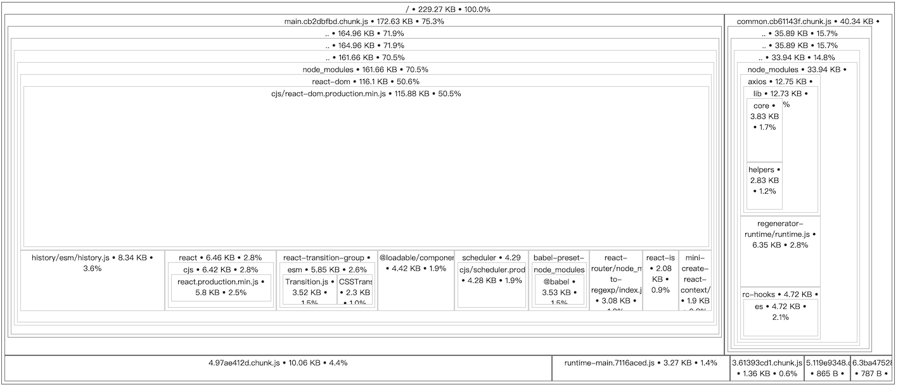

# 构建和部署

## 构建

当项目开发完毕，只需要运行以下命令就可以打包应用：

```bash
yarn build
```

打包后的资源在 `dist` 目录。

## 分析构建包

1. 在 `config/env.js` 将生产环境配置的 `GENERATE_SOURCEMAP` 注释

```javascript
// GENERATE_SOURCEMAP: "false",
```

<mark>分析完成后，记得去掉该注释</mark>

2. 重新构建

```bash
yarn build
```

3. 运行分析脚本

```bash
yarn analyze
```



## 部署

- 检查 `config/env.js` 生产环境下的 `PUBLIC_URL` `REACT_APP_API` 配置是否正确。
- 检查构建后的 `dist/index.html` 看看引入的资源路径是否正确。

如果以上都没问题，只需将 `dist` 目录下的资源拷贝到 web 服务器即可。

---

如果需要将文件进行 zip 压缩再发到服务器，可以使用：

```bash
yarn zip
```

你也可以在 `config/zip.js` 配置压缩选项。
