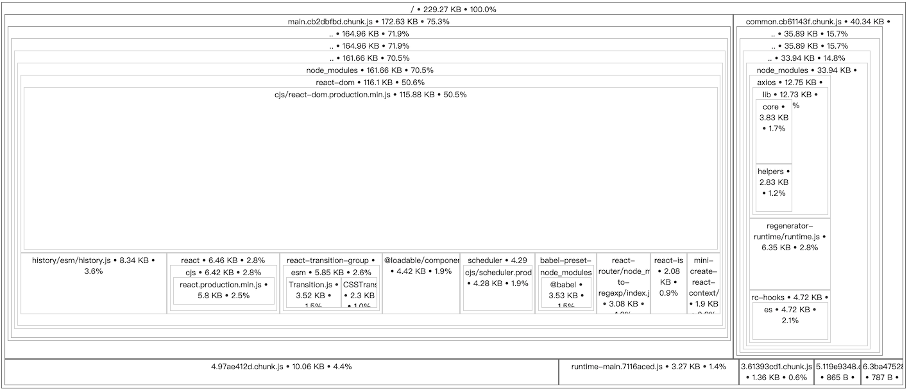

# Build and deploy

## Build

When the project is developed, you only need to run the following command to package the application:

```bash
yarn build
```

Resources in the package `dist` directory.

## Analysis build package

Run the analysis script, build it separately `dist-analyze`, and automatically open the browser to access.

```bash
yarn analyze
```



## Deploy

- Check `config/env.js` in a production environment `PUBLIC_URL` `REACT_APP_API` is configured correctly.
- After checking to build `dist/index.html` resources to see the introduction of the path is correct.

If the above is no problem, just the `dist` resource directory are copied to the web server.

---

If you need to zip the file and send it to the server, you can use:

```bash
yarn zip
```

You can also in the `config/zip.js` configuration of compression options.
