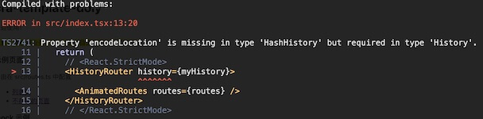

# FAQ

## How to jump pages in non-component modules?

Use directly `src/router.tsx` :

```typescript
import router from '@/router';

// util function
function xxx() {
  router.navigate('/list');
}
```

## error message `Property 'encodeLocation' is missing in type 'HashHistory' but required in type 'History'.`

If you use a project earlier than react-router-dom@6.4, you may receive the following error after reinstalling dependencies:



This is because the react-router@6.4 version removes the history dependency and adds the RouterProvider.

package.json lock 'react-router-dom@~6.3.0' dependent version.

## How to turn off the route switching animation?

`src/index.tsx` The `AnimatedRoutes` component settings `animated={false}`

```typescript
<AnimatedRoutes
  // ...
  animated={false}
/>
```

## Load on demand `antd@4`?

Install dependencies `babel-plugin-import`

```bash
yarn add babel-plugin-import --dev
```

Modify file `config/config.js` configuration

```javascript
// ...
babel: {
  plugins: [
    ...whenProd(() => [['transform-remove-console', { exclude: ['error', 'warn'] }]], []),
    ['import', { libraryName: 'antd', libraryDirectory: 'lib', style: true }, 'antd']
  ];
}
```

## How to elegantly implement login verification for the pre-login project?

> This scheme is suitable for login and current project which are not in the same project and require complex token conversion.
>
> If it's a simple project, just handle it `utils/request.ts` in.

If the current project must be logged in before entering, it is recommended to extract a separate Authcomponent for login verification. Such as:

`src/components/Auth/index.tsx`

```typescript
import { tokenChange } from '@/services/common';
import { getToken, setToken, getAccessToken, setAccessToken } from '@/utils/tokenStorage';
import { toLoginPage } from '@/utils/utils';

const Auth = ({ children }) => {
  const [logined, setLogined] = React.useState(false);

  React.useEffect(() => {
    const accessToken = getAccessToken();

    if (!accessToken) {
      const loginToken = getToken(); // Third way token

      if (loginToken) {
        // Convert the current project token
        tokenChange().then(res => {
          setAccessToken(res.accessToken);
          setLogined(true);
        });
      } else {
        if (process.env.REACT_APP_ENV === 'dev') {
          // local development
          setToken('252Be844PzHnVqmQ');
          setAccessToken('1zdaf7876546352aflkj');
          setLogined(true);
        } else {
          toLoginPage();
        }
      }
    }
  }, []);

  return <>{logined ? children : null}</>;
};

export default Auth;
```

Put the Auth component in the outermost layer of the project.

`src/index.tsx`

```typescript
import Auth from '@/components/Auth';
// ...

function App() {
  // ...
  return <Auth>{/*//...*/}</Auth>;
}
```

## Package management tools switching to `pnpm` ?

1. Use `pnpm import` to import the lock dependency version file, and then delete `package-lock.json` or `yarn.lock`
2. Delete the `node_modules` directory
3. Add the `.npmrc` file to the root of the project, in order to set the dependency flattening

`.npmrc` file:

```text
shamefully-hoist=true
auto-install-peers=true # If you are using nodejs <= 16, pnpm < 8, you need to enable this option manually.
```

4. Reinstall the dependencies using `pnpm install`, and then run the script with the `pnpm` command
5. `git hook` tool tweaks, upgrade `husky` or change `yorkie` to `husky`

> Since Yorkie and earlier versions of Husky don't support PNPM, an upgrade is required.
>
> Here's an example of yorkie changing to `husky@8`

```bash
# Delete yorkie or lower version husky
pnpm remove yorkie

# Delete the .git/hooks directory manually
rm -rf .git/hooks

# Install husky
pnpm dlx husky-init && pnpm install

# Add git hooks
npx husky add .husky/commit-msg 'npx --no -- commitlint --edit "$1"'
```

Switch the `gitHooks` or `husky` configuration in `package.json` to `.husky`.

Then remove `gitHooks` or `husky` in `package.json`.

For example, `pre-commit`

```bash
#!/usr/bin/env sh
. "$(dirname -- "$0")/_/husky.sh"

npx --no-install lint-staged
```

6. Whether the running, testing, and building projects are normal

```bash
pnpm start
pnpm test
pnpm build
```
